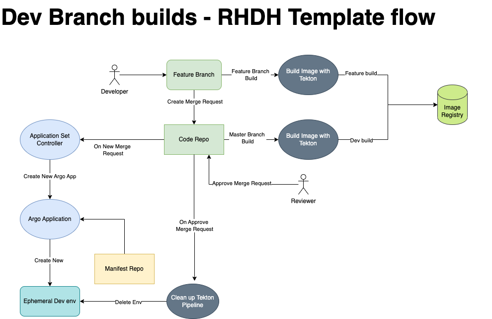
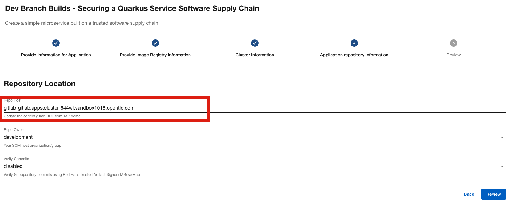

# Dev Build Branch Template

This repository contains the Backstage Template used to create the Kubernetes resources needed to build/deploy a simple quarkus application it shows when developer creates new branch and commit their code it builds an image with the new branch name and also when a merge request is created it deploys a new ephemeral environment to run integration testing required.

Once the merge request is merged it deletes the ephemeral environment it created.

## Introduction

This template has been designed to work only with TAP demo (https://demo.redhat.com/catalog?item=babylon-catalog-prod/enterprise.redhat-tap-demo.prod&utm_source=webapp&utm_medium=share-link) it assumes all the infrastructure rquired are available.

## Registering Template.

This new template can be registered on developer hub instance with Register existing component from create section. The URL should be https://github.com/redhat-na-ssa/rhdh-tap-dev-ephemeral-env-template/blob/main/template.yaml

## Application Flow

Application flow is shown below.



## How to Demo.

Create a new instance of application by using this template ("Dev Branch Builds - Securing a Quarkus Service Software Supply Chain" )once registered. This template will work both Image Registry and Quay Registry.

Please update the following URLs. These URL should point to current TAP demo instance.

1) Image Registry/Quay : OpenShift on step 2
2) Cluster URL on step 3
3) Gitlab URL on step 4




Once the application is created, start the regular build from master branch by making a change in index.html file. Also create a new branch for the created application like `feature-abc`

``` 
   git checkout -b feature-abc
```   

   
   Make changes to the following files

```
   1.ExampleResource.java
   2.ExampleResourceTest.java
   3.api.test.js
   4.index.html
```   

```
   mvn quarkus:test
   git add .
   git commit -m "Added new branch"
   git push --set-upstream origin feature-abc 
```

This will start a new build for branch `feature-abc`

Once the build is complete create a merge request in gitlab for the code repo. The merge request will be monitored by application set controller and creates a new argo application and deploys the new instance of the application with feature branch.

Run the integration-test pipeline which uses `playwright` framework to perform integration testing. Once completed merge the mergerequest and this cleans up the environment.